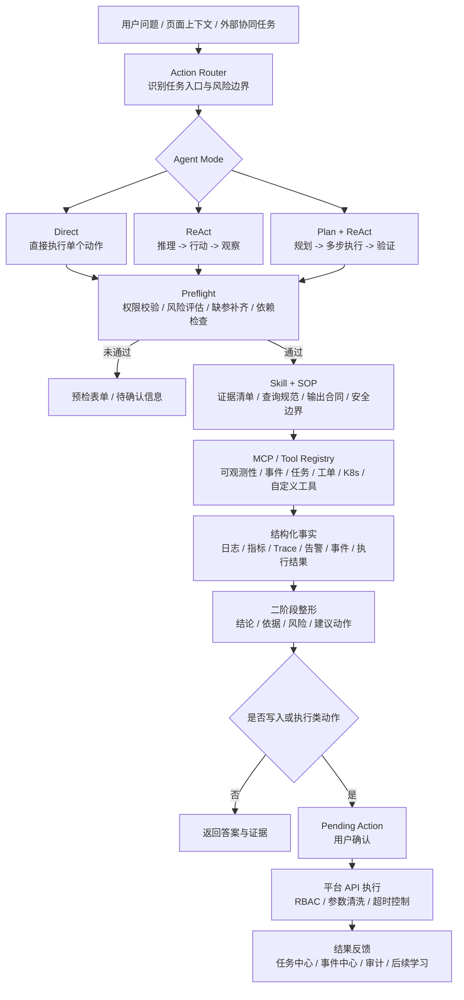
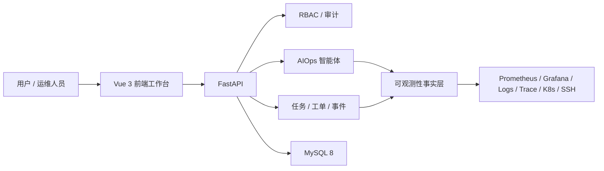

# AI Ops

AI Ops 是一个面向真实运维现场的开源智能运维 Agent 平台。它把 **可观测性、事件中心、任务中心、工单审批、容器管理、RBAC** 等平台能力组织成 Agent 可调用、可审计、可确认的运维工作流。

项目不是简单做一个聊天框，而是希望让运维从“到处查系统”升级为：


## 为什么需要它

传统运维现场里，信息和动作经常被拆散：

- 告警中心看到红点，但日志、Trace 和最近变更在别的系统里。
- 发布、审批、任务执行、失败结果和关键操作散落在不同页面，复盘成本高。
- 巡检、批量命令、脚本模板和主机权限脱节，动作入口不统一。
- 排障经验依赖个人记忆，结论难沉淀，下一次仍要重新查。

AI Ops 的目标是把这些碎片化能力收敛成一条链路：**可观测性取证，事件中心复盘，任务中心行动，AIOps 负责理解、规划和结构化输出**。

## 产品定位

AI Ops AI Agent = **可观测性 + 事件中心 + 任务中心 + AIOps**

| 层次 | 说明 |
| --- | --- |
| 可观测性事实层 | 聚合告警、指标、日志、Trace、Grafana 和系统态势，形成 Agent 可查询的证据来源。 |
| 事件中心 | 沉淀最终执行结果、关键写操作、失败定位线索和复盘上下文。 |
| 任务中心 | 承接主机巡检、批量命令、脚本模板、任务草稿、执行历史和计划任务。 |
| AIOps 智能体 | 使用 LLM 做理解与规划，使用 MCP 工具取数，使用 Skill 约束输出，使用后端完成权限、确认、执行和审计。 |

一句话理解：

**模型负责理解，平台负责边界；Agent 可以分析和生成草稿，但关键动作必须通过权限校验和人工确认。**

## 核心能力

| 模块 | 能力 |
| --- | --- |
| AIOps 智能体 | 自然语言排障、工具调用、二阶段回答、Skill 模板、Action 预检、待确认动作、模型调用审计 |
| 可观测性 | 平台总览、系统态势、指标查询、日志检索、链路追踪、Grafana 看板承接、数据源管理 |
| 事件中心 | 失败事件定位、关键操作沉淀、事件源接入、操作审计、按系统/环境/应用/时间过滤 |
| 任务中心 | 主机任务、批量命令、脚本模板、资源分组、任务草稿、执行历史、计划任务 |
| 工单系统 | 应用发布、审批流、SQL 审计、事务工单、变更留痕 |
| 容器管理 | Kubernetes 集群、工作负载、Pod 终端、ConfigMap / Secret、Docker 环境管理 |
| 权限与审计 | 后端 API、前端路由、菜单、按钮和 WebSocket 场景统一接入 RBAC |

## 典型场景

以“生产 order-center 异常分析”为例。

传统方式通常要人工切换多个系统：

1. 打开告警平台看 PromQL、标签和触发时间。
2. 到日志中心查错误关键字和上下文。
3. 到链路追踪定位慢调用和异常 Span。
4. 翻最近发布、任务、审批和事件记录。
5. 手工整理结论和下一步动作。

在 AI Ops 里，可以让 Agent 串起这条链路：

1. 用户用自然语言发起分析。
2. Agent 选择告警、日志、Trace、事件中心、任务中心等工具。
3. 后端按白名单执行工具调用，并做 RBAC、参数清洗和超时控制。
4. 平台汇总结构化证据，Skill 输出结论、依据、风险和建议操作。
5. 如需巡检或命令执行，先生成任务草稿，用户确认后才进入任务中心。
6. 执行结果继续回写事件中心和审计链路。

## Agent 工作机制

AI Ops 的 Agent 运行逻辑不是“用户提问 -> 大模型自由回答”，而是一套受控编排链路：**Action Router 先判断任务类型，Agent Mode 决定推理方式，Preflight 守住执行边界，Skill/SOP 约束专业过程，MCP 连接外部与平台工具，最终由审计和反馈闭环沉淀结果**。



这条链路里几个核心概念的职责是：

| 层次 | 职责 |
| --- | --- |
| Action Router | 识别本次问题属于告警根因、日志查询、K8s 诊断、变更关联、任务生成等哪类 Action，并声明风险等级、所需上下文、输出结构和确认策略。 |
| Agent Mode | 按任务复杂度选择执行方式：`Direct` 适合单步只读或明确动作，`ReAct` 适合边查边判断，`Plan + ReAct` 适合多步骤深度排障和协同任务。 |
| Preflight | 在进入写入、生成或执行前做权限校验、风险评估、依赖检查、缺参补齐和回滚就绪检查；不满足条件时返回预检表单或待确认信息。 |
| Skill / SOP | 沉淀领域能力包，约束证据清单、查询规范、判断规则、输出格式和安全边界，避免模型自由发挥。 |
| MCP / Tool Registry | 把平台能力和外部系统封装成可治理工具，最终可用工具由 `Skill 工具依赖 ∩ MCP 可用性 ∩ 用户 RBAC ∩ Action 安全策略` 决定。 |
| Pending Action | 所有写入和执行类动作先变成待确认动作，用户确认后才由平台 API 执行。 |
| 审计与反馈 | 会话、工具调用、预检、待确认动作、执行结果和关键事件都会留痕，执行结果继续回写任务中心和事件中心。 |

当前实现遵循几个原则：

- 平台 API 是唯一执行边界，模型只负责理解、规划和生成候选参数，不能绕过后端直接操作资源。
- Action 负责“任务入口和流程策略”，Skill 负责“能力包和专业约束”，两者不混在一起。
- 只读诊断可以直接返回事实；生成、写入、执行类动作必须先预检、再确认、再执行。
- Preflight 不是装饰步骤，而是权限、风险、依赖、缺参和回滚检查的统一入口。
- 前端展示权限只是体验优化，后端 RBAC 才是安全边界。
- 会话、工具调用、Action 预检、待确认动作、执行结果和关键事件都要留痕。


## 技术栈

| 层级 | 技术 |
| --- | --- |
| 后端 | FastAPI、SQLAlchemy 2、Alembic、Pydantic 2、Uvicorn |
| 前端 | Vue 3、Vue Router、Pinia、Element Plus、ECharts、Vite |
| 数据库 | MySQL 8；自动化服务测试使用内存 SQLite |
| 鉴权与安全 | Token 认证、RBAC、Argon2id、Fernet 配置密文 |
| 外部集成 | Kubernetes API、Docker、SSH、Prometheus / Grafana、SkyWalking、Tempo、Jaeger、Zipkin、Loki / ELK / SLS |

## 架构概览



## 快速启动

### 方式一：Docker Compose

（目前是自己build镜像，后面稳定版我推到 dockerhub 镜像仓库，这样首次部署可以不用拉依赖了）
仓库内置应用、MySQL 和 Redis 编排，适合最快体验完整功能：

```bash
docker compose up -d --build
```

启动后访问：

- 平台入口：`http://localhost:8000`
- MySQL 和 Redis 由 Compose 内部网络提供

首次启动时容器会自动执行：

```bash
python -m alembic upgrade head
python -m scripts.bootstrap_data
python -m scripts.bootstrap_agent_config
```

容器入口必须使用 `aidevops.main:app`，并通过私有环境变量提供 MySQL 与服务端密钥配置。

### 方式二：本地开发

后端：

```powershell
cd backend
python -m venv .venv
.\.venv\Scripts\python.exe -m pip install -r requirements.txt
Copy-Item .env.example .env
.\.venv\Scripts\python.exe -m alembic upgrade head
.\.venv\Scripts\python.exe -m scripts.bootstrap_data
.\.venv\Scripts\python.exe -m uvicorn aidevops.main:app --reload --host 127.0.0.1 --port 8000
```

前端：

```bash
cd frontend
npm install
npm run dev
```

本地开发地址：

- 前端：`http://localhost:3000`
- 后端：`http://localhost:8000`

Windows 下也可以使用开发辅助脚本一键启动或停止前后端：

```powershell
.\tools\dev\start-dev.ps1
.\tools\dev\stop-dev.ps1
```

## 配置说明

复制 `.env.example` 为私有 `.env` 后填写 MySQL 连接和服务端密钥。不要提交 `.env`、数据库密码、模型密钥或数据源凭据。

可观测性指标查询通过 `AIOPS_METRIC_ALLOWED_ORIGINS` 显式允许可信的 HTTP、内网或特殊端口 Prometheus origin。例如本机 Prometheus 可配置为 `["http://localhost:9090"]`。默认配置 `AIOPS_METRIC_ALLOWED_ORIGINS=[]` 只允许符合安全策略的公网 HTTPS 目标。

常用环境变量：

```env
MYSQL_HOST=127.0.0.1
MYSQL_PORT=3307
MYSQL_DATABASE=AIOps
MYSQL_USER=aiops
MYSQL_PASSWORD=aiops_password
AIOPS_ADMIN_INITIAL_PASSWORD=admin
AIOPS_CONFIG_ENCRYPTION_KEY=<Fernet key>
AIOPS_MODEL_ALLOWED_INTERNAL_ORIGINS=[]
AIOPS_MCP_ALLOWED_INTERNAL_ORIGINS=[]
AIOPS_METRIC_ALLOWED_ORIGINS=[]
```

应用运行环境使用 MySQL；自动化服务测试使用独立的内存 SQLite，不会连接或修改本机开发数据库。

## 常用命令

```powershell
# 后端测试
cd backend
.\.venv\Scripts\python.exe -m pytest -q

# 前端构建
cd frontend && npm run build

# 初始化基础数据
cd backend
.\.venv\Scripts\python.exe -m scripts.bootstrap_data

# 初始化智能体配置
.\.venv\Scripts\python.exe -m scripts.bootstrap_agent_config

# Docker Compose 停止服务
docker compose down
```

## 目录结构

```text
.
├── backend/                 #
│   ├── aidevops/            # 项目设置、ASGI/WSGI、路由入口
│   ├── aiops/               # AIOps 智能体、模型、工具、审计
│   ├── ops/                 # 运维任务、可观测性、发布、告警等
│   ├── eventwall/           # 事件中心
│   ├── rbac/                # 权限、角色、菜单与审计
│   └── ...                  # marketplace、sqlaudit、iac、multicloud 等模块
├── frontend/                # Vue 3 前端项目
│   └── src/
│       ├── views/           # 页面
│       ├── layout/          # 布局
│       ├── api/             # API 封装
│       ├── router/          # 路由
│       └── stores/          # Pinia 状态
├── docs/                    # 产品截图与设计文档
├── docker/                  # 容器入口脚本
├── tools/dev/               # Windows 本地开发辅助脚本
├── docker-compose.yml       # 本地容器化部署
└── Dockerfile               # 前后端一体镜像
```


## 路线图

- 扩展告警处置、工单汇总、K8s 异常、任务生成等 Skill 模板族。
- 增强内置 MCP 和外部 MCP 的健康检查、工具发现、鉴权与超时诊断。
- 在只读诊断后继续接入审批、命令模板、Runbook 和任务编排。
- 建立更可信的事实链路：告警准、事件准、任务准、结果准。
- 将高频、低风险动作逐步纳入可确认、可回滚、可审计的自动化闭环。


## 开源协议

AI Ops 基于 [Apache License 2.0](LICENSE) 开源。分发或二次开发时请保留项目中的 [NOTICE](NOTICE) 文件。
